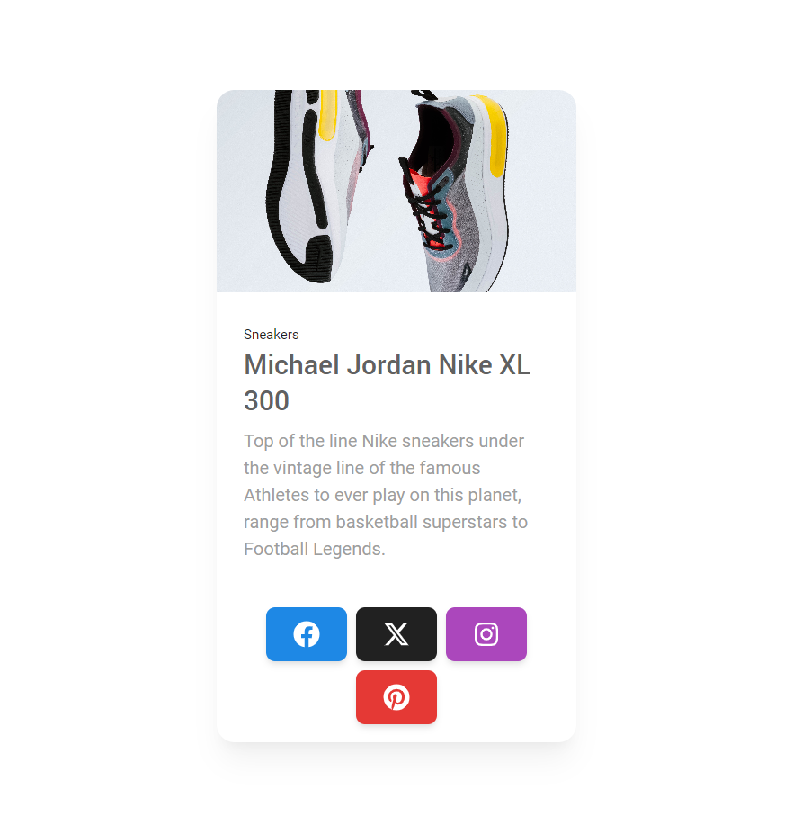

# 

## Table of contents

- [Overview](#overview)
  - [Screenshot](#screenshot)
  - [Links](#links)
- [My process](#my-process)
  - [Built with](#built-with)
  - [Continued development](#continued-development)
- [Author](#author)

## Overview

This is a challenge of the #100daysofUI and the prompt was as follows:

Prompt: Social Share

Design a social share button/icon and be mindful of the size, imagery, placement, and purpose for sharing. It could be to share an article snippet, or a simple link with a photo.

### Screenshot

### Links

- Solution URL: [Github Repo](https://github.com/Robert-Thaiyah/30-days-ui-to-react-challenge/tree/main/Day-10)
- Live Site URL: [Livesite URL]()

## My process

- First I did research on the different trypes of Social Share pages from Dribbble and Behance websites.
- After that, I created a simple mockup using Figma and Adobe XD.
- Then I built a shell using Reactand Material Tailwind.

### Built with

- Semantic HTML5 markup
- Flexbox
- CSS Grid
- Tailwind CSS
- React

### Continued development

- Create more projects to polish up tailwind, React and design principles using Figma.

## Author

- Website - [Git Profile](https://github.com/Robert-Thaiyah)

