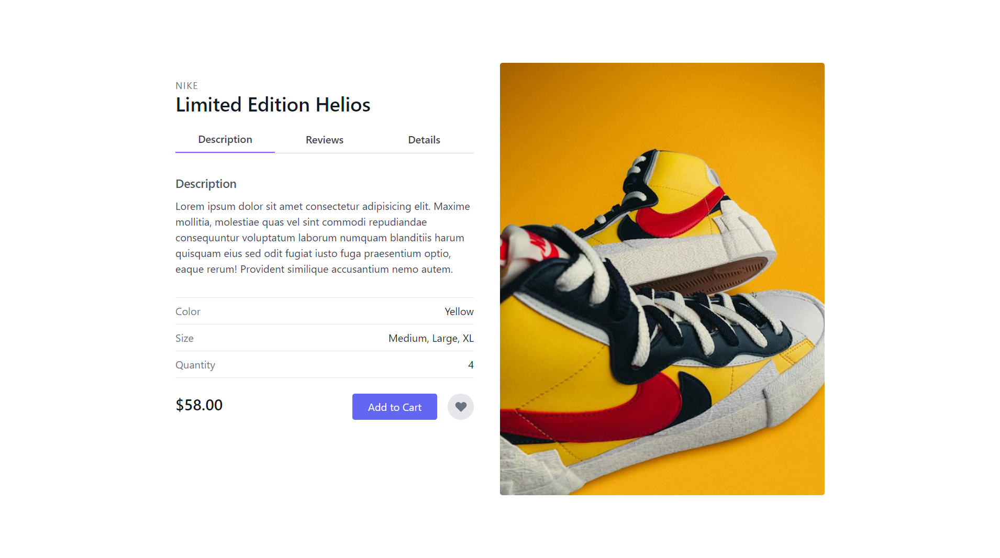

# 

## Table of contents

- [Overview](#overview)
  - [Screenshot](#screenshot)
  - [Links](#links)
- [My process](#my-process)
  - [Built with](#built-with)
  - [Continued development](#continued-development)
- [Author](#author)

## Overview

This is a challenge of the #100daysofUI and the prompt was as follows:

Prompt: E-commerce Shop

Design an e-commerce shop. Is it simple for a local business or a large online retailer? Is it for clothing, shoes, handmade soap, or something else? 

Consider the brand, the products offered, product views, product options, desired actions (conversions, product views, pricing options, etc.) and of course, the users!

### Screenshot

### Links

- Solution URL: [Github Repo](https://github.com/Robert-Thaiyah/30-days-ui-to-react-challenge/tree/main/Day-15)
- Live Site URL: [Livesite URL]()

## My process

- First I did research on the different trypes of E-commerce pages from Dribbble and Behance websites.
- After that, I created a simple mockup using Figma.
- Then I built a shell using React and Tailwind.
- Navigation through the three tabs added.
### Built with

- Semantic HTML5 markup
- Flexbox
- CSS Grid
- Tailwind CSS

### Continued development

- Create more projects to polish up tailwind, React and design principles using Figma.

## Author

- Website - [Git Profile](https://github.com/Robert-Thaiyah)

