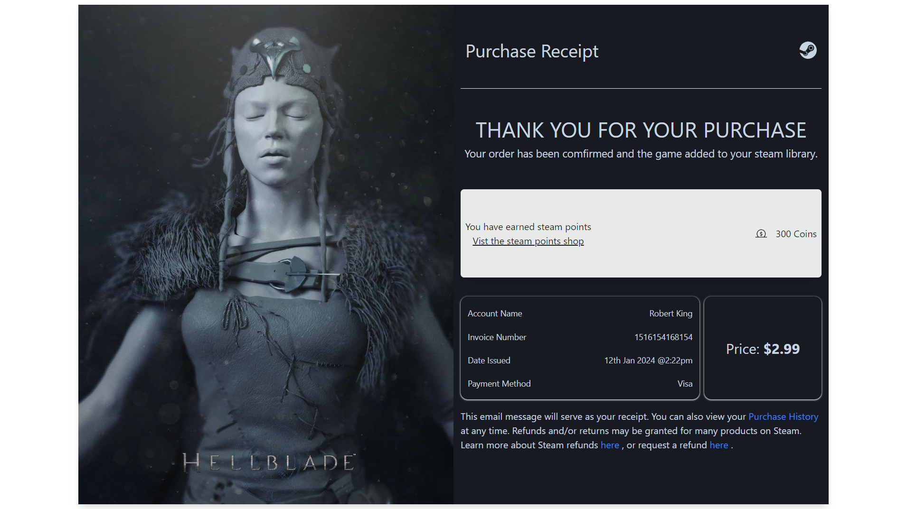

# 

## Table of contents

- [Overview](#overview)
  - [Screenshot](#screenshot)
  - [Links](#links)
- [My process](#my-process)
  - [Built with](#built-with)
  - [Continued development](#continued-development)
- [Author](#author)

## Overview

This is a challenge of the #100daysofUI and the prompt was as follows:

Prompt: Purchase Receipt

What was purchased? On what date? How much was the item? And from what source and vendor? Consider other elements such as a customer support info, a tracking number or receipt number, business location/phone number/website, pictures if needed, and any other related elements. 
 
Tip:  The bottoms and tops of receipts are usually really underutilized. They can be great places to inform customers about upcoming promotions, news, ask for feedback, or promote your social media with a QR code.

### Screenshot

### Links

- Solution URL: [Github Repo](https://github.com/Robert-Thaiyah/30-days-ui-to-react-challenge/tree/main/Day-17)
- Live Site URL: [Livesite URL]()

## My process

- First I did research on the different trypes of Purchase Receipts UI from Dribbble and Behance websites.
- After that, I created a simple mockup using Figma.
- Then I built a shell using React and Tailwind.

### Built with

- Semantic HTML5 markup
- Flexbox
- CSS Grid
- Tailwind CSS

### Continued development

- Create more projects to polish up tailwind, React and design principles using Figma.

## Author

- Website - [Git Profile](https://github.com/Robert-Thaiyah)

