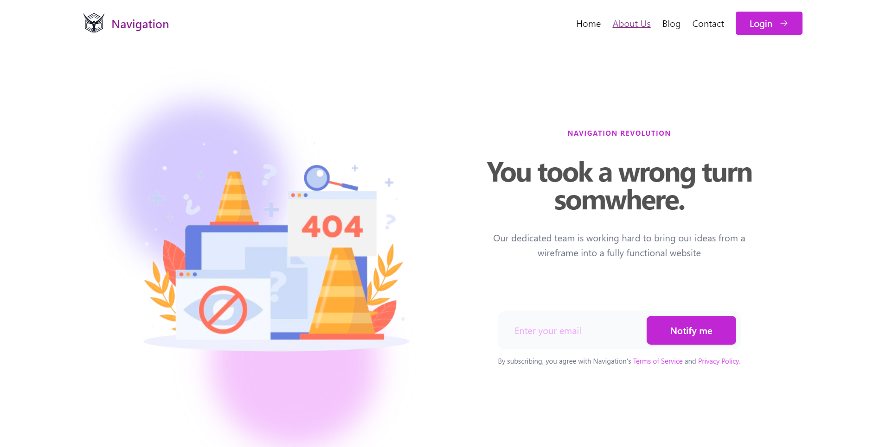

# 

## Table of contents

- [Overview](#overview)
  - [Screenshot](#screenshot)
  - [Links](#links)
- [My process](#my-process)
  - [Built with](#built-with)
  - [Continued development](#continued-development)
- [Author](#author)

## Overview

This is a challenge of the #100daysofUI and the prompt was as follows:

Prompt:  404 Page Design

Design a 404 page - that's not boring! 
 
Does it suit the brand's style? Is it user-friendly? It might sound mundane, but not everything can be flashy or glamorous. Every day millions of people will be landing on 404 pages. You have an opportunity to help them in a way that's useful and aesthetically pleasing. (It's up to you!)

### Screenshot

### Links

- Solution URL: [Github Repo](https://github.com/Robert-Thaiyah/30-days-ui-to-react-challenge/tree/main/Day-8)
- Live Site URL: [Livesite URL]()

## My process

- First I did research on the different trypes of UI 404 pages from Dribbble and Behance websites.
- After that, I created a simple mockup using Figma and Adobe XD.
- Then I built a shell using React and Tailwind.
- Added some small functionality using Javascript (later).
### Built with

- Semantic HTML5 markup
- Flexbox
- CSS Grid
- Tailwind CSS

### Continued development

- Create more projects to polish up tailwind, React and design principles using Figma.

## Author

- Website - [Git Profile](https://github.com/Robert-Thaiyah)

