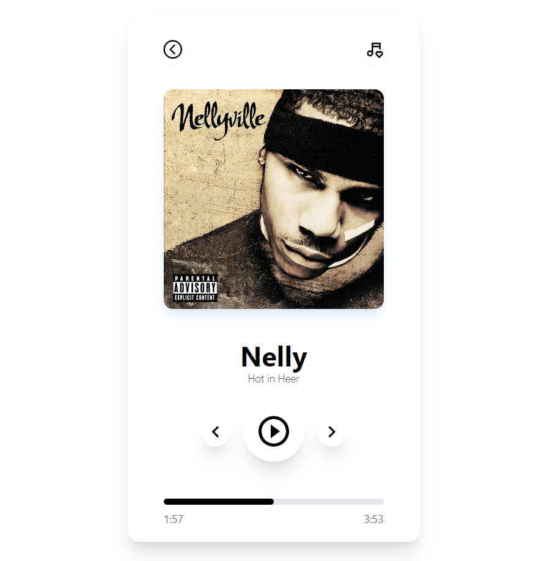

# 

## Table of contents

- [Overview](#overview)
  - [Screenshot](#screenshot)
  - [Links](#links)
- [My process](#my-process)
  - [Built with](#built-with)
  - [Continued development](#continued-development)
- [Author](#author)

## Overview

This is a challenge of the #100daysofUI and the prompt was as follows:

Prompt: Music Player

Design a music player. It could be browser based or an app (i.e. Pandora, Spotify, SoundCloud, etc.) or in a standalone product like in a car dashboard, jukebox, etc.
 
Consider the controls, placements, imagery such as the artist or album cover, etc. Also, consider the device type that's playing the music. A dashboard in a tour bus, a smartwatch, or via a web browser. Each device type will have different requirements, features, and restrictions to consider.

### Screenshot

### Links

- Solution URL: [Github Repo](https://github.com/Robert-Thaiyah/30-days-ui-to-react-challenge/tree/main/Day-9)
- Live Site URL: [Livesite URL]()

## My process

- First I did research on the different trypes of UI music players from Dribbble and Behance websites.
- After that, I created a simple mockup using Figma and Adobe XD.
- Then I built a shell using React and Tailwind.
- Functionality will be added later as I continue to read and practise React UseState.
### Built with

- Semantic HTML5 markup
- Flexbox
- CSS Grid
- Tailwind CSS

### Continued development

- Create more projects to polish up tailwind, React and design principles using Figma.

## Author

- Website - [Git Profile](https://github.com/Robert-Thaiyah)

